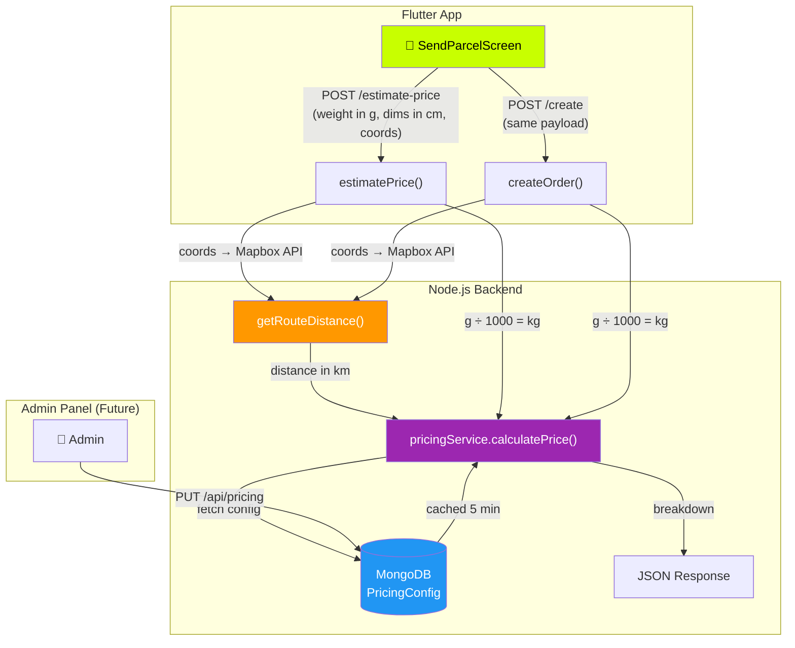
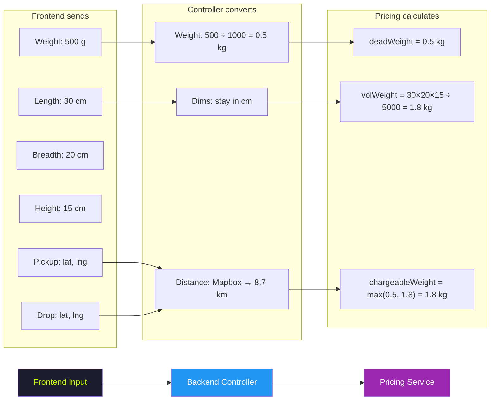
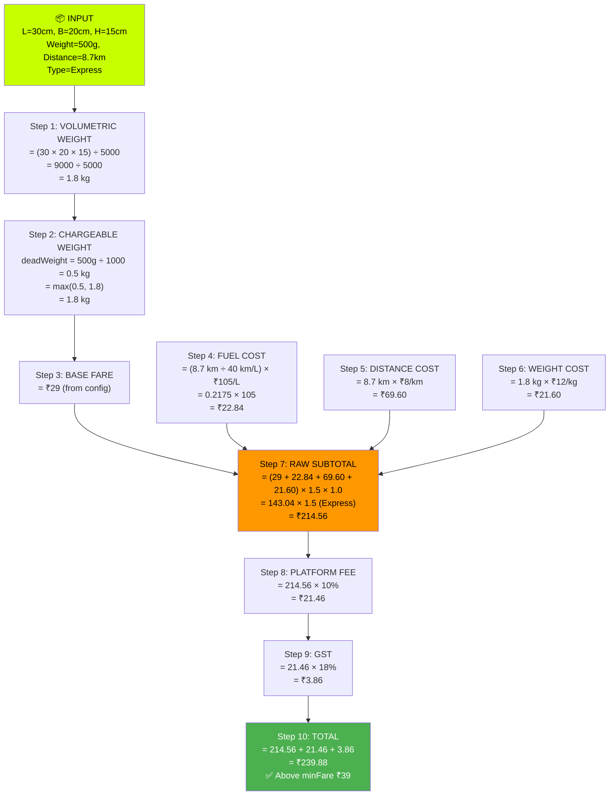
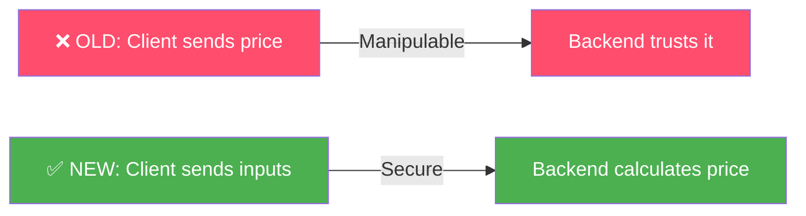
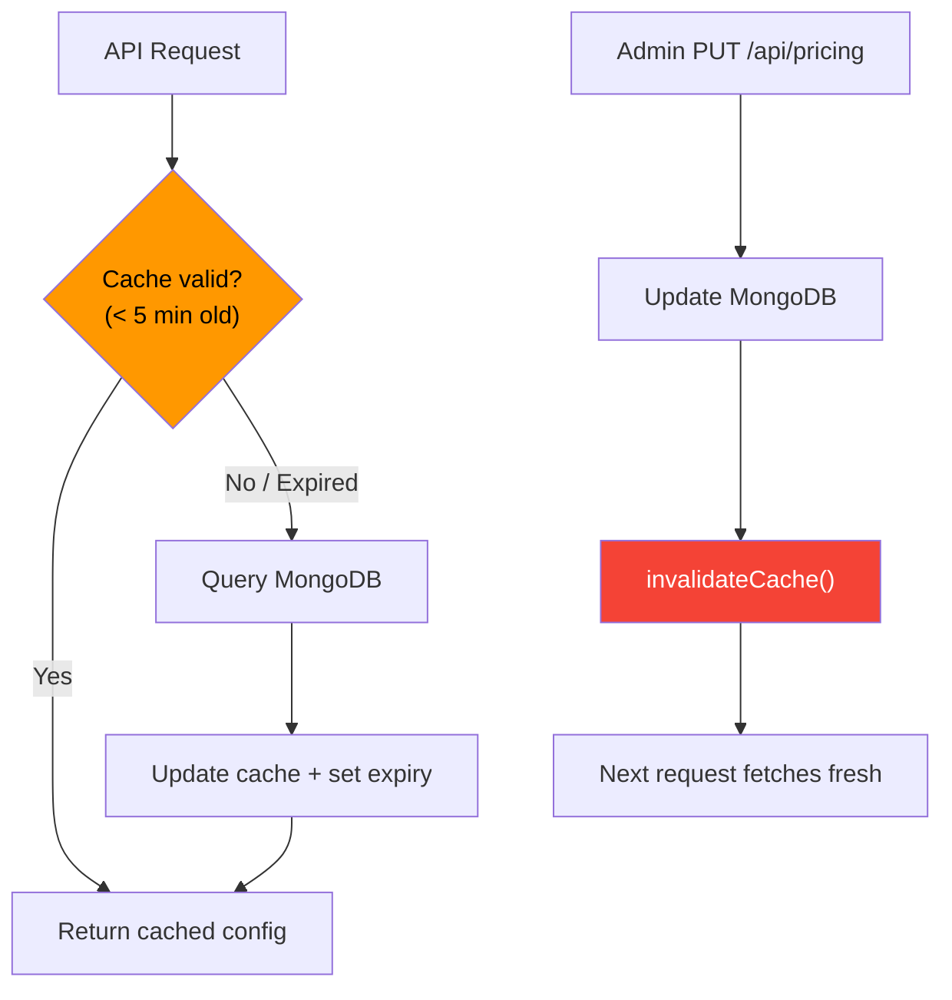

# 🚀 Avigo Pricing Engine — Technical Documentation

> Production-grade logistics pricing system for Avigo parcel delivery platform.  
> All values are **admin-configurable via MongoDB** — zero hardcoding.

---

## 📐 Architecture Overview



---

## 🔄 Complete Request Flow

```mermaid
sequenceDiagram
    participant User as 📱 Flutter App
    participant API as 🖥️ Express API
    participant Mapbox as 🗺️ Mapbox API
    participant Pricing as ⚙️ pricingService
    participant DB as 🗄️ MongoDB

    Note over User: User fills form:<br/>Pickup/Drop coords, Weight(g),<br/>Dimensions(cm), DeliveryType

    User->>API: POST /api/orders/estimate-price
    API->>Mapbox: GET directions?coordinates=lng1,lat1;lng2,lat2
    Mapbox-->>API: route distance (km)

    API->>API: Convert weight: grams ÷ 1000 = kg

    API->>Pricing: calculatePrice({deadWeight, distance, dims, ...})
    Pricing->>DB: findOne({ isActive: true })
    Note over Pricing,DB: Uses 5-min in-memory cache

    DB-->>Pricing: PricingConfig document
    Pricing->>Pricing: Run formula (see below)
    Pricing-->>API: Full breakdown JSON

    API-->>User: { totalAmount, baseFare, fuelCost, ... }

    Note over User: User sees live price<br/>with full breakdown

    User->>API: POST /api/orders/create
    Note over API: Same flow → server recalculates<br/>price (ignores any client price)
```

---

## 📊 Unit Conversion Pipeline



| What | Frontend Sends | Backend Receives | Pricing Service Gets |
|---|---|---|---|
| **Weight** | `500` (grams) | `500` (grams) | `0.5` (kg) — divided by 1000 |
| **Length** | `30` (cm) | `30` (cm) | `30` (cm) — no conversion |
| **Breadth** | `20` (cm) | `20` (cm) | `20` (cm) — no conversion |
| **Height** | `15` (cm) | `15` (cm) | `15` (cm) — no conversion |
| **Distance** | ❌ Not sent | Calculated via Mapbox | `8.7` (km) |
| **Delivery Type** | `"express"` | `"express"` | `"express"` → multiplier `1.5×` |

---

## 🧮 Pricing Formula — Step by Step



### Formula in plain text:

```
┌─────────────────────────────────────────────────────────────────┐
│                                                                 │
│  volumetricWeight = (Length × Breadth × Height) ÷ 5000          │
│  chargeableWeight = max(deadWeight_kg, volumetricWeight)        │
│                                                                 │
│  fuelCost     = (distance_km ÷ mileage) × petrolPrice          │
│  distanceCost = distance_km × pricePerKm                       │
│  weightCost   = chargeableWeight × pricePerKg                   │
│                                                                 │
│  rawSubtotal  = (baseFare + fuelCost + distanceCost + weightCost│
│                  + insuranceCharge)                              │
│                 × deliveryMultiplier                             │
│                 × surgeMultiplier                                │
│                 × vehicleMultiplier                              │
│                                                                 │
│  platformFee  = rawSubtotal × (platformFeePercent ÷ 100)       │
│  gst          = platformFee × (gstPercent ÷ 100)               │
│                                                                 │
│  totalAmount  = max(rawSubtotal + platformFee + gst, minFare)  │
│                                                                 │
└─────────────────────────────────────────────────────────────────┘
```

---

## ⚙️ PricingConfig — Default Values

All stored in MongoDB (`PricingConfig` collection). Admin can update via `PUT /api/pricing`.

| Variable | Default | Unit | Description |
|---|---|---|---|
| `baseFare` | `29` | ₹ | Fixed charge per order |
| `minFare` | `39` | ₹ | Floor price — total never below this |
| `pricePerKg` | `12` | ₹/kg | Cost per kg of chargeable weight |
| `pricePerKm` | `8` | ₹/km | Flat per-km distance charge |
| `mileage` | `40` | km/L | Vehicle fuel efficiency |
| `petrolPrice` | `105` | ₹/L | Current petrol rate |
| `volumetricDivisor` | `5000` | — | Industry standard divisor |
| `platformFeePercent` | `10` | % | Platform commission on subtotal |
| `gstPercent` | `18` | % | GST on platform fee only |
| `surgeMultiplier` | `1.0` | × | 1.0 = no surge (future: dynamic) |
| `insurancePercent` | `0` | % | % of product worth as insurance |

### Delivery Type Multipliers

| Type | Multiplier | Estimated Time |
|---|---|---|
| **Standard** | `1.0×` | 2–3 hours |
| **Express** | `1.5×` | ~45 minutes |
| **Same Day** | `1.8×` | Same day delivery |

### Vehicle Multipliers (Future)

| Vehicle | Multiplier |
|---|---|
| Cycle | `0.7×` |
| Bike | `1.0×` |
| Scooter | `1.0×` |
| Car | `1.8×` |

---

## 📡 API Reference

### 1. `POST /api/orders/estimate-price`

> Get price breakdown **before** booking. No order is created.

**Auth:** Bearer token required

**Request Body:**
```json
{
  "pickup":       { "lat": 28.6139, "lng": 77.2090 },
  "drop":         { "lat": 28.5355, "lng": 77.2100 },
  "weight":       500,
  "length":       30,
  "breadth":      20,
  "height":       15,
  "deliveryType": "express",
  "productWorth": 5000,
  "vehicleType":  "bike"
}
```

> ⚠️ **Weight is in GRAMS. Dimensions are in CM.**  
> Distance is NOT sent — calculated server-side via Mapbox.

**Response (200):**
```json
{
  "volumetricWeight": 1.8,
  "chargeableWeight": 1.8,
  "deadWeight": 0.5,

  "baseFare": 29,
  "fuelCost": 22.84,
  "distanceCost": 69.6,
  "weightCost": 21.6,
  "insuranceCharge": 0,

  "deliveryType": "express",
  "deliveryMultiplier": 1.5,
  "surgeMultiplier": 1.0,
  "vehicleMultiplier": 1.0,

  "subtotal": 214.56,
  "platformFee": 21.46,
  "platformFeePercent": 10,
  "gst": 3.86,
  "gstPercent": 18,

  "totalAmount": 239.88,
  "minFare": 39,
  "distance": 8.7
}
```

---

### 2. `GET /api/pricing` (Admin only)

Returns the current active pricing config from MongoDB.

### 3. `PUT /api/pricing` (Admin only)

Update any pricing variable. Changes take effect within 5 minutes (cache TTL) or immediately if cache is invalidated.

**Example — increase petrol price:**
```json
{
  "petrolPrice": 112
}
```

**Example — enable surge pricing:**
```json
{
  "surgeMultiplier": 1.3
}
```

**Example — update all delivery multipliers:**
```json
{
  "deliveryMultipliers": {
    "standard": 1.0,
    "express": 1.6,
    "sameDay": 2.0
  }
}
```

---

## 🗂️ File Structure

```
AvigoBackends/
├── models/
│   └── PricingConfig.js          ← Mongoose schema (all config vars)
├── services/
│   └── pricingService.js         ← Core pricing logic + cache
├── controllers/
│   └── orderController.js        ← estimatePrice() + createOrder()
├── routes/
│   ├── orderRoutes.js            ← POST /estimate-price
│   └── pricingRoutes.js          ← Admin GET/PUT /api/pricing
└── server.js                     ← Route mounting
```

---

## 🔒 Security: Server-Side Pricing



| Before | After |
|---|---|
| Frontend calculated `₹49 + ₹30 = ₹79` | Frontend sends weight, dims, coords |
| Sent `price: 79` to backend | Backend calculates `₹239.88` from config |
| ⚠️ User could modify to `price: 1` | ✅ Price is tamper-proof |

---

## 🛠️ Caching Strategy



- **In-memory cache** with 5-minute TTL
- Invalidated immediately on admin config update
- First-ever request auto-seeds default config to DB

---

## 🚀 Scaling Roadmap

### Phase 1 — Current ✅
- [x] Volumetric vs dead weight
- [x] Fuel + distance + weight costing
- [x] Delivery type multipliers
- [x] Platform fee + GST
- [x] Min fare enforcement
- [x] Admin-configurable via DB
- [x] In-memory cache

### Phase 2 — Near Term
- [ ] **Redis cache** (for multi-instance / horizontal scaling)
- [ ] **Distance slabs** (₹8/km for 0-5km, ₹6/km for 5-15km, ₹4/km for 15+km)
- [ ] **Coupon/discount engine** (flat ₹ off, % off, first-order discount)

### Phase 3 — Advanced
- [ ] **Dynamic surge pricing** (demand/supply ratio per zone)
- [ ] **Vehicle-type selection** in Flutter UI
- [ ] **Zone-based pricing** (city tiers, rural vs urban)
- [ ] **Time-based pricing** (night surcharge, festival pricing)
- [ ] **Weight slabs** (₹12/kg for 0-5kg, ₹10/kg for 5-20kg)

---

## 📝 Quick Reference Card

```
┌─────────────────── PRICING CHEAT SHEET ──────────────────────┐
│                                                               │
│  INPUT:   Weight(g), L×B×H(cm), Pickup/Drop coords           │
│  OUTPUT:  ₹ totalAmount with full breakdown                   │
│                                                               │
│  WEIGHT:  volW = L×B×H ÷ 5000 → max(dead, vol) = charged    │
│  FUEL:    distance ÷ mileage × petrol                        │
│  DIST:    distance × ₹8/km                                   │
│  WEIGHT:  charged × ₹12/kg                                   │
│  MULTI:   × delivery(1.0/1.5/1.8) × surge × vehicle         │
│  FEE:    subtotal × 10% platform                             │
│  TAX:    platformFee × 18% GST                               │
│  TOTAL:  max(subtotal + fee + tax, ₹39)                      │
│                                                               │
│  CONFIG:  PUT /api/pricing → DB → auto-refresh in ≤5min      │
│                                                               │
└───────────────────────────────────────────────────────────────┘
```
